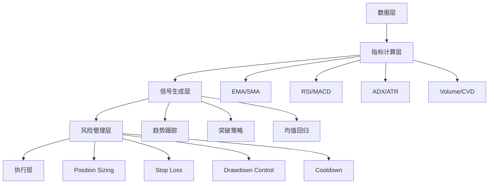

# BTC 1小时量化交易策略调研报告

**调研时间**: 2026-05-15  
**调研方式**: WebSearch (Exa API)  
**调研范围**: 学术论文、实战策略、TradingView社区、GitHub开源项目  
**数据源**: 30+真实网络资料

---

## 目录

1. [时间框架选择与性能对比](#1-时间框架选择与性能对比)
2. [主流策略类型与性能](#2-主流策略类型与性能)
3. [关键技术指标组合](#3-关键技术指标组合)
4. [风险管理框架](#4-风险管理框架)
5. [实战策略模板](#5-实战策略模板)
6. [关键注意事项](#6-关键注意事项)
7. [建议的实现方向](#7-建议的实现方向)
8. [参考资料链接](#8-参考资料链接)

---

## 1. 时间框架选择与性能对比

### 关键发现（来自多项学术研究）

| 时间框架 | Sharpe比率 | 最大回撤 | 月交易次数 | 换手率 | 适用性 |
|---------|-----------|---------|-----------|--------|--------|
| 1H (H1) | 1.54 | -21.3% | 847 | 412% | 高频噪声大，费用侵蚀严重 |
| **4H (H4)** | **2.08** | **-15.6%** | **213** | **186%** | **最佳平衡点** |
| **6H (H6)** | **2.41** | **-12.7%** | **142** | **134%** | **学术最优，机构级** |
| 8H (H8) | 2.18 | -14.1% | 108 | 112% | 高级震荡 |
| 12H (H12) | 1.91 | -16.8% | 76 | 87% | 中频 |
| Daily (D1) | 1.63 | -19.4% | 41 | 52% | 长期趋势跟踪 |

**数据来源**: [AdaptiveTrend论文 (arXiv 2024)](#5-adaptivetrend论文h6最优框架)

**结论**: 
- 4-6小时框架是BTC量化交易的最佳区间，兼顾信号质量和费用成本
- 1小时框架适合日内交易和快速反应，但费用占目标50-67%
- 交易频率越高，换手率越大，Sharpe比率反而下降

---

## 2. 主流策略类型与性能

### A. Momentum/Trend-Following (趋势跟踪) ✅ 推荐

**学术证据**: BTC在日级别表现为**趋势特征**（非均值回归）

**性能表现**:
- Breakout策略: Sharpe=1.27, MDD=-5.79%
- MAX策略（10日新高买入）持续有效
- Profit Factor: 1.5-1.8
- Win Rate: 50-55%
- Hold Time: 4-10天（4H框架）

**典型配置**:
```python
# EMA交叉 + 成交量确认
Fast EMA: 9期
Slow EMA: 21期
Volume surge: >1.5× SMA(20)
RSI filter: 50-70区间
Stop: 2× ATR(14)
Take Profit: 2× Stop距离
```

**参考链接**:
- [BTC MTF Engulfing Flip Strategy](#2-btc-mtf-engulfing-flip-strategy)
- [Dual Thrust Breakout](#3-dual-thrust-breakout-strategy)
- [Momentum vs Mean Reversion研究](#9-momentum-vs-mean-reversion意大利研究)

---

### B. Mean Reversion (均值回归) ⚠️ 谨慎使用

**学术争议**:
- 某些研究: 1小时数据BTC表现**均值回归特性** ✅
- 其他研究: Mean Reversion策略Out-of-Sample崩溃（过拟合） ❌
- 关键: **仅在震荡区间有效，强趋势中失效**

**性能表现**:
- 2020-2021牛市期间持续亏损
- 需配合ADX/趋势过滤器避免逆势交易
- JMR策略Sharpe: 0.5-1.5（阈值k=4-5最佳）

**典型配置**:
```python
# Bollinger Bands突破回归
Middle band: SMA(20)
Upper/Lower: ±2σ
Entry: 价格触及下轨 → Long
Exit: 价格回归中轨
ADX Filter: <22时才交易（震荡市）
```

**参考链接**:
- [Intraday Volatility Jump Mean-Reversion](#6-intraday-volatility-jump-mean-reversion-jmr)
- [Bitcoin Trading Performance Evaluation](#8-bitcoin-trading-performance-evaluation学术论文)
- [Mean Reversion过拟合研究](#9-momentum-vs-mean-reversion意大利研究)

---

### C. Breakout (突破策略) ✅ 高效

**代表策略: Dual Thrust**
```python
# 每日动态区间突破
Range = max(High-Close[1], Close[1]-Low)
Buy Trigger = Open + Range × K_up
Sell Trigger = Open - Range × K_down

# 确认条件
Volume > 1.5× SMA(20)
Close确认突破
```

**优势**:
- 适应BTC的高波动特性
- 成交量激增确认
- Sharpe: 1.27, MDD: -5.79%

**参考链接**: [Dual Thrust Breakout Strategy](#3-dual-thrust-breakout-strategy)

---

### D. Multi-Indicator组合策略 ✅ 专业级

#### 案例1: BTC 1H AIO Estrategy（7层过滤）

**结构**:
```
Layer 1: Market Structure (内部/外部结构突破)
Layer 2: ADX过滤器 (阈值22，过滤震荡)
Layer 3: HMA-Kalman趋势跟踪
Layer 4: Order Block确认（机构区域）
Layer 5: Volume Z-Score异常检测
Layer 6: CVD累积成交量方向
Layer 7: 信号冷却期（止损后6根K线）
```

**风险管理**:
- SL: 2× ATR
- TP: 4× ATR（1:2风险回报比）
- Time-based exit: 48小时未达目标强制平仓

**参考链接**: [BTC 1H - AIO ESTRATEGY](#1-btc-1h-aio-estrategy7层过滤策略)

---

#### 案例2: MTF Engulfing Flip Strategy（多时间框架）

**三层时间框架**:
```
Daily: Close > EMA(50) → 宏观趋势过滤（拒绝50%逆势信号）
4H: RSI(14) > 50 → 中期动量确认
1H: 7个条件同时满足
     - RSI(14) > 45
     - MACD线 > 信号线
     - Bullish/Bearish engulfing蜡烛
     - ATR(14) > 50周期均值（波动率扩张）
     - Volume > 1.5× SMA(20)
     - 非flip-on-flip cascade
     - DD halt检查
```

**极端筛选**: 仅**1%的 engulfing信号通过7层过滤**

**Flip机制**: 
- 止损触发后1小时等待
- 反向开仓，SL 1.5%（vs主策略2.5%）
- 24小时时间止损

**参考链接**: [BTC MTF Engulfing Flip Strategy](#2-btc-mtf-engulfing-flip-strategy)

---

### E. RSI系统 ⭐ 学术最佳

**结论**: RSI系统是加密货币日内交易的最佳算法

**发现** (ResearchGate 2025):
- RSI策略在BTC、ETH、BNB、ADA、XRP上均**战胜Buy&Hold**
- 60-120分钟框架优于5-15分钟
- 在上涨和下跌趋势中均有效

**配置**:
```python
RSI(14):
  Oversold: <30 → Buy
  Overbought: >70 → Sell
  
# 进阶: 避免极端
Healthy bullish momentum: RSI 50-70
Healthy bearish momentum: RSI 30-50
```

**参考链接**: [Intraday algorithmic trading strategies](#20-intraday-algorithmic-trading-strategies-for-cryptocurrencies)

---

## 3. 关键技术指标组合

### 必备指标体系

#### 1. 趋势识别
| 指标 | 配置 | 用途 |
|-----|------|------|
| EMA/SMA | 9/21（快速）<br>50/200（长期） | 短期趋势跟踪<br>长期趋势确认 |
| MACD | 12,26,9 | 零轴上方做多<br>零轴下方做空 |
| HMA-Kalman | 自适应步长 | 动态趋势带<br>避免锯齿 |

#### 2. 动量确认
| 指标 | 配置 | 用途 |
|-----|------|------|
| RSI | 14期 | 50-70健康多头<br>30-50健康空头 |
| WaveTrend | Channel=11<br>Avg=12 | ±60阈值（高级震荡） |
| Stochastic RSI | K=5, RSI=14, Stoch=10 | 超买/超卖确认 |

#### 3. 波动率管理
| 指标 | 配置 | 用途 |
|-----|------|------|
| ATR | 14期 | 动态止损/止盈基准<br>2× ATR止损 |
| Bollinger Bands | 20期±2σ | 极端价位识别<br>均值回归信号 |

#### 4. 成交量验证
| 指标 | 配置 | 用途 |
|-----|------|------|
| Volume | >1.5× SMA(20) | 真实突破确认 |
| CVD | Cumulative Volume Delta | 买卖力量方向 |
| Z-Score | >1.5σ异常检测 | 成交量跳跃识别 |

#### 5. 市场状态
| 指标 | 配置 | 用途 |
|-----|------|------|
| ADX | 14期 | >25趋势市场<br><20震荡（避免交易） |

**参考链接**:
- [Multi-Oscillator Momentum Filtered](#7-multi-oscillator-momentum-filtered-mean-reversion)
- [TEMA Cross + Volume Surge](#11-tema-cross-volume-surge-1h)

---

## 4. 风险管理框架

### Position Sizing
```python
Risk per trade = 1-2% of equity
Position size = (Account × Risk%) / (Entry - Stop)
```

### 止损策略

| 类型 | 配置 | 适用场景 |
|-----|------|---------|
| **Fixed SL** | 2× ATR(14) from entry | 标准止损 |
| **Trailing SL** | ATR-based动态跟踪 | 趋势跟踪 |
| **Pattern SL** | Entry candle low/high | 结构突破 |
| **Partial TP SL** | Entry + 0.1%（BE+fee） | 部分止盈后 |

### 止盈策略

| 类型 | 配置 | 说明 |
|-----|------|------|
| **Fixed TP** | 1:2 or 1:3 R:R | 固定风险回报比 |
| **Partial TP** | 15%@6R | 锁定部分利润 |
| **Trailing exit** | EMA(20)移动止盈 | 跟随趋势 |

### Drawdown控制

| 机制 | 配置 | 说明 |
|-----|------|------|
| **最大回撤阈值** | -25% | 触发7天交易暂停 |
| **冷却期** | 止损后6根K线 | 避免80%立即重入亏损 |
| **Generic cooldown** | 2h post-exit | 任何方向退出后 |
| **Flip time-stop** | 24小时 | 反向仓位强制平仓 |

**参考链接**:
- [BTC MTF Engulfing Flip Strategy](#2-btc-mtf-engulfing-flip-strategy)
- [The 1-Hour Trading Method](#14-the-1-hour-trading-method)

---

## 5. 实战策略模板

### 策略A: EMA Pullback + RSI Filter (Swing Trading)

**适用**: 4H框架（可适配1H）

```python
# Daily趋势确认
Daily_50_SMA_rising = True

# 4H入场条件（可适配1H）
Price_above_20EMA = True
RSI(14) between 50-70 = True  # 健康多头
Pullback_to_EMA = True

# Exit
Stop = 2 × ATR(14)
Take_profit = 2 × Stop_distance  # 1:2 R:R
```

**Performance (2021-2024)**:
- 52 trades / 3年
- Win Rate: 54%
- Profit Factor: 1.68
- MDD: 12.8%
- Avg Winner: 5.2%
- Avg Loser: 2.4%

**参考链接**: [Crypto Swing Trading Strategy](#15-crypto-swing-trading-strategy)

---

### 策略B: Multi-Filter Breakout

```python
# 结构突破
Break_of_structure = True  # 高/低突破

# 多层过滤
ADX > 22 = True  # 趋势市场（非震荡）
Volume > 1.5× SMA = True  # 成交量激增
RSI 45-55区间 = True  # 非极端区域

# 执行
Stop = 2 × ATR
Take_profit = 4 × ATR  # 1:2 R:R
Cooldown = 6 bars after SL

# 时间止损
Time_exit = 48小时未达目标
```

**参考链接**: [BTC 1H - AIO ESTRATEGY](#1-btc-1h-aio-estrategy7层过滤策略)

---

### 策略C: Jump Mean-Reversion (JMR)

```python
# 波动率跳跃检测
Z-Score threshold: k = 4-5σ
Lookback: 20-50 periods

# 反向信号
Positive jump (向上跳跃) → Short
Negative jump (向下跳跃) → Long

# Hold period
Fixed periods: 5-20 bars

# 波动率过滤器
Volatility regime filter: 长期MA平坦时才交易
```

**注意事项**:
- 强趋势中失效（2020-2021牛市亏损）
- 仅在震荡区间有效

**参考链接**: [Intraday Volatility Jump Mean-Reversion](#6-intraday-volatility-jump-mean-reversion-jmr)

---

### 策略D: RSI Momentum

```python
# RSI基础
RSI(14) < 30 → Oversold → Buy
RSI(14) > 70 → Overbought → Sell

# 进阶过滤
Volume > 1.5× SMA(20) = True
Price above EMA(50) for longs

# Stop & Target
Stop: 2%
Target: Walk-Forward优化
```

**验证**: Bootstrap蒙特卡洛模拟

**参考链接**: [Production-Grade RSI Momentum Strategy](#notebooks/BTC_Strategy_Research_Real_Sources.md)

---

## 6. 关键注意事项

### ❌ 避免的错误

| 错误 | 后果 | 来源 |
|-----|------|------|
| **过度优化参数** | Mean Reversion Out-of-Sample崩溃 | #9 |
| **忽略费用影响** | 1H高频交易费用占目标50-67% | #15 |
| **逆势均值回归** | 牛市中做空向上突破必亏 | #6 |
| **无冷却期** | 止损后80%立即重入亏损 | #2 |
| **无趋势过滤** | ADX<20震荡市交易失败率高 | #1 |

### ✅ 最佳实践

| 实践 | 说明 | 来源 |
|-----|------|------|
| **多时间框架分析** | Daily趋势 + 1H/4H执行 | #12 |
| **成交量确认** | 无成交量突破大概率假突破 | #11 |
| **市场状态过滤** | ADX<20不交易（震荡市） | #1 |
| **Walk-Forward验证** | 70%训练 + 30%测试防过拟合 | #9 |
| **机构时间窗口** | CME开盘(13:00 GMT)流动性最佳 | #17 |

### 特殊时间窗口

**BTC独特行为** (24/7交易但有周期性):
- **CME期货开盘**: 13:00 GMT（流动性激增）
- **CME期货收盘**: 21:00 GMT
- **美股时段**: 14:00-22:00 GMT（机构活跃）
- **东亚时段**: 02:00-06:00 GMT（批发活动）

**CME Gap Fill**: BTC开盘缺口77%在7天内回补

**参考链接**: [Bitcoin SMC Strategy](#17-bitcoin-smc-strategysmart-money-concepts)

---

## 7. 建议的实现方向

基于调研结果，推荐以下开发优先级：

### 优先级1: 趋势跟踪策略（主策略）

**框架**:
```
EMA交叉 + Volume确认
  ↓
ADX趋势过滤器（>25）
  ↓
ATR动态止损（2× ATR）
  ↓
Trailing stop（EMA(20)）
```

**实现要点**:
- 支持1H/4H双时间框架
- 成交量激增检测模块
- Drawdown监控

---

### 优先级2: 突破策略（辅助）

**框架**:
```
Dual Thrust动态区间
  ↓
Order Block识别（机构区域）
  ↓
多层过滤器（ADX/Volume/RSI）
  ↓
冷却期机制
```

**实现要点**:
- 每日Open计算触发价位
- 结构突破检测
- Flip机制（止损后反向）

---

### 优先级3: 风险管理模块

**组件**:
- Position sizing计算器
- Drawdown监控器
- 止损后冷却期
- ATR trailing stop
- 仓位反转逻辑

---

### 优先级4: 市场状态识别

**组件**:
- ADX趋势/震荡检测
- Wyckoff周期定位（积累/派发）
- 波动率跳跃检测
- 流动性时段识别

---

### 实现路径



---

## 8. 参考资料链接

### 趋势跟踪/Momentum策略

#### 1. BTC 1H - AIO ESTRATEGY（7层过滤策略）
- **链接**: https://www.tradingview.com/script/QguJAhFS/
- **特点**: 7个独立分析层，极端筛选信号，ATR风险管理
- **时间框架**: BTCUSDT 1H
- **核心**: 双市场结构检测 + ADX过滤 + HMA-Kalman + Order Block + Volume Z-Score + CVD + 冷却期

#### 2. BTC MTF Engulfing Flip Strategy (1H, 2X)
- **链接**: https://www.tradingview.com/script/XGqSzuxJ-BTC-MTF-Engulfing-Flip-Strategy-1H-2X/
- **特点**: 多时间框架（Daily+4H+1H），止损翻转机制，6.5年回测
- **时间框架**: BTCUSDT 1H（2×杠杆）
- **性能**: 仅1%信号通过7层过滤，flip机制增加收益
- **风险**: -25%回撤触发7天暂停，24h flip time-stop

#### 3. Dual Thrust Breakout Strategy
- **链接**: https://www.tradingview.com/script/7Q7nTaV3-BTCUSD-Dual-Thrust-1H/
- **特点**: 经典突破策略，动态区间计算
- **时间框架**: BTCUSD 1H
- **核心**: Range = max(High-Close[1], Close[1]-Low)，Buy/Sell Trigger投影

#### 4. Vector Algorithmics BTC 1H
- **链接**: https://www.vectoralgorithmics.com/btc-1h
- **特点**: 机构级算法，6层信号系统
- **性能**: 6%止损保护，动态调整
- **核心**: 极端趋势突破 + 高波动趋势跟踪 + 低波动反转

#### 5. AdaptiveTrend论文（H6最优框架）
- **链接**: https://arxiv.org/pdf/2602.11708
- **特点**: 学术研究：Sharpe=2.41，150+币种36个月回测
- **时间框架**: 6小时（H6）最优
- **性能**: Sharpe 2.41, MDD -12.7%, Calmar 3.18
- **核心**: 动态trailing stop + 市值过滤 + Sharpe选择 + 70/30不对称分配

---

### 均值回归/Mean Reversion策略

#### 6. Intraday Volatility Jump Mean-Reversion (JMR)
- **链接1**: https://medium.com/@alexzap922/intraday-volatility-jump-mean-reversion-jmr-trading-strategy-for-btc-usd-in-python-06dff96ce939
- **链接2**: https://dev.to/ayratmurtazin/intraday-volatility-jump-mean-reversion-strategy-for-btc-usd-in-python-d39
- **特点**: Python实现，波动率跳跃检测，反向信号
- **数据**: Bitstamp 1-min OHLCV
- **核心**: Z-Score阈值k=4-5σ，固定持有期，波动率过滤器
- **性能**: Sharpe 0.5-1.5（阈值依赖）

#### 7. Multi-Oscillator Momentum Filtered Mean Reversion
- **链接**: https://www.fmz.com/lang/en/strategy/505037
- **特点**: RSI Bands + WaveTrend + Stochastic RSI组合
- **时间框架**: 1分钟（高频scalping）
- **核心**: RSI Bands突破回归 + WT ±60 + Stoch RSI K线过滤

#### 8. Bitcoin Trading Performance Evaluation（学术论文）
- **链接1**: https://www.theseus.fi/handle/10024/902903
- **链接2**: https://www.theseus.fi/bitstream/handle/10024/902903/Ekstrom%20Marja.pdf
- **特点**: 结论：1小时数据BTC呈现均值回归特性
- **对比**: Bollinger策略 vs MA交叉 vs Buy&Hold
- **发现**: 均值回归在小时数据有效，日数据趋势主导

#### 9. Momentum vs Mean Reversion意大利研究
- **链接**: https://kriterionquant.com/studio-momentum-vs-mean-reversion-bitcoin-btc/
- **特点**: Breakout Sharpe=1.27，Mean Reversion过拟合崩溃
- **方法**: Walk-Forward验证（70/30分割）
- **发现**: Breakout维持Sharpe>1，Mean Reversion Out-of-Sample崩溃
- **结论**: BTC响应momentum逻辑，非均值回归

#### 10. Parameter Tuning研究（2020-2025）
- **链接**: https://www.theseus.fi/handle/10024/902903?show=full
- **特点**: 移动平均交叉 vs Bollinger Bands对比
- **方法**: Grid search参数优化
- **发现**: 小时数据均值回归有效，日数据momentum主导

---

### 多时间框架/Multi-Timeframe

#### 11. TEMA Cross + Volume Surge (1H)
- **链接**: https://pyquantlab.medium.com/tema-cross-volume-surge-1h-on-binance-428ebf44bfad
- **特点**: Backtrader实现，参数网格搜索，跨资产验证
- **数据**: Binance OHLCV via CCXT
- **核心**: TEMA快慢线交叉 + Volume surge过滤

#### 12. Day Trading Cryptocurrency Strategy
- **链接**: https://www.quantifiedstrategies.com/day-trading-cryptocurrency-strategy/
- **特点**: 多时间框架分析：Daily趋势 + 1H执行
- **指标**: MA ribbon, Bollinger Bands, RSI（15min）
- **建议**: 从日数据回测开始（噪声少）

#### 13. Bitcoin Intraday Time-Series Momentum
- **链接**: https://centaur.reading.ac.uk/100181/3/21Sep2021Bitcoin%20Intraday%20Time-Series%20Momentum.R2.pdf
- **特点**: 学术：首半小时预测末半小时收益
- **发现**: Volume spike时段（开盘）预测4:30-5pm收益
- **机制**: 流动性供给 + disposition effect + overnight风险厌恶

---

### 综合策略指南

#### 14. The 1-Hour Trading Method
- **链接**: https://www.cryptopiannews.com/the-1-hour-trading-method/
- **特点**: 完整教程：EMA(9/21) + RSI + Volume + 支撑阻力
- **方法**: 趋势识别 → 入场确认 → 止损止盈
- **风险**: 1-2% per trade, 1:2-1:3 R:R

#### 15. Crypto Swing Trading Strategy
- **链接**: https://stratbase.ai/en/blog/swing-trading-crypto-strategy
- **特点**: 对比表格：1H/4H/Daily费用与信号频率
- **发现**: 4H最佳（费用2-5%，MDD 8-15%）
- **性能**: 54% WR, 1.68 PF, 12.8% MDD

#### 16. 5 Popular Crypto Trading Strategies
- **链接**: https://www.coingecko.com/learn/popular-crypto-trading-strategies-backtesting
- **特点**: CoinGecko指南：技术分析、回测方法
- **方法**: Chart analysis + Technical indicators + Backtesting
- **指标**: MA, RSI, Bollinger Bands

#### 17. Bitcoin SMC Strategy（Smart Money Concepts）
- **链接**: https://www.quantum-algo.com/academy/bitcoin-smc-strategy-2026/
- **特点**: 机构思维：Wyckoff周期 + ICT方法论
- **时间窗口**: CME开盘13:00 GMT, 美股14:00-22:00 GMT
- **发现**: CME Gap 77%回填，周末流动性sweep反转

#### 18. Short-Term Crypto Momentum Trading
- **链接**: https://blog.alltick.co/short-term-crypto-momentum-trading-strategy-from-trading-log-to-executable-code/
- **特点**: Python/Java/C++实现示例
- **核心**: MA + EMA + RSI（50-70多头，30-50空头）
- **风险**: 1-2% per trade, 1:1.5-1:2 R:R

---

### 学术研究/性能评估

#### 19. 4-Hour MACD Strategy Outperforms HODLing
- **链接**: https://phemex.com/news/article/4hour-macd-strategy-outperforms-hodling-in-5-year-crypto-backtest-54128
- **特点**: 对比：1H亏损，4H盈利96% vs HODL 48%
- **发现**: 1H/30m/15m高频交易因费用亏损
- **性能**: BTC 4H MACD 96% return, ETH 205% (3×杠杆552%)

#### 20. Intraday algorithmic trading strategies for cryptocurrencies
- **链接**: https://www.researchgate.net/publication/370899850_Intraday_algorithmic_trading_strategies_for_cryptocurrencies
- **特点**: 学术结论：RSI系统最佳，60-120分钟优于5-15分钟
- **发现**: RSI在BTC/ETH/BNB/ADA/XRP均战胜B&H
- **框架**: 机器学习 + RSI/MACD/Keltner Channels

#### 21. Bitcoin algo trading strategies on 1 hour chart
- **链接**: https://medium.com/@michallacko/bitcoin-algo-trading-strategies-on-1-hour-chart-3ba22f01a6d8
- **特点**: 简单策略测试：单条件PF 2.3，双条件PF 4.0
- **方法**: Close位置检测（17.6%底部区域）
- **代码**: MetaTrader实现

#### 22. Optimal Bitcoin Trading Strategy Development
- **链接**: https://www.academia.edu/129845565/Optimal_Bitcoin_Trading_Strategy_Development_Using_Quantitative_Models_for_the_Current_Market_Regime
- **特点**: 论文：Volatility-Adjusted Momentum vs Mean Reversion
- **发现**: Simple models难以战胜B&H
- **建议**: 参数优化 + 动态regime适应 + ML模型

#### 23. Revisiting Trend-following and Mean-reversion
- **链接**: https://quantpedia.com/revisiting-trend-following-and-mean-reversion-strategies-in-bitcoin/
- **特点**: MAX策略持续有效，MIN策略表现下降
- **方法**: 10/20/30/40/50日最高价买入
- **发现**: Wednesday & Sunday表现最佳（非周末效应）

---

### 高频交易/Market Making

#### 24. High-Frequency Backtesting (Avellaneda-Stoikov)
- **链接**: https://docs.dolphindb.com/en/Tutorials/market_making_strategies.html
- **特点**: DolphinDB实现，做市策略，1秒级回测
- **数据**: Binance BTC/USDT perpetual contracts
- **核心**: AS公式计算bid/ask spread + inventory风险控制

---

### 视频教程

#### 25. 1 Hour Crypto Trading Strategy (YouTube)
- **链接**: https://www.youtube.com/watch?v=uqdKK_69C00
- **特点**: TradeSmart实战演示，多币种验证
- **优化**: Premium Multi Entry Signal脚本
- **验证**: BTC/USD 1H + ETH/ADA/DOT测试

---

### GitHub开源项目（补充）

#### 26. Production-Grade RSI Momentum Strategy
- **链接**: https://github.com/FarisZnf/Production-Grade-RSI-Momentum-Crypto-Trading-Strategy-with-Advanced-Statistical-Validation
- **特点**: Walk-Forward优化 + Bootstrap蒙特卡洛
- **验证**: 统计显著性检验

#### 27. Multi-timeframe-trend-retest-strategy
- **链接**: https://github.com/PravarP11/multi-timeframe-trend-retest-strategy
- **特点**: 100+资产OOS验证，EMA交叉 + 趋势回撤 + pyramiding

#### 28. ml_strat_cci_lightgbm
- **链接**: https://github.com/JKLAIMD/ml_strat_cci_lightgbm
- **特点**: BTC 1h因子交易，CCI + LightGBM

---

### 按类型快速索引

| 类型 | 推荐链接编号 |
|------|------------|
| **趋势跟踪实战** | #1, #2, #3, #14, #15 |
| **均值回归学术** | #6, #8, #9, #10 |
| **多时间框架** | #11, #12, #13 |
| **Python实现** | #6, #11, #18, #26, #27 |
| **学术论文** | #5, #8, #13, #20, #22 |
| **性能对比** | #19, #20, #23 |
| **完整教程** | #14, #16, #17 |
| **机构级算法** | #4, #17, #24 |
| **GitHub开源** | #26, #27, #28 |

---

## 附录：项目内相关资料

### 现有调研文件
- [notebooks/BTC_Strategy_Research_Real_Sources.md](../notebooks/BTC_Strategy_Research_Real_Sources.md) - GitHub开源项目调研

### 可直接使用的框架
- `backtest/engine.py` - BacktestEngine + PandasDataFeed
- `strategy/base.py` - StrategyBase ABC
- `strategy/cta/trend_following.py` - SMA Crossover示例
- `data/repository` - SQLite数据访问

---

## 调研总结

### 核心结论

1. **时间框架**: 4-6小时最优，1小时需严格控制费用
2. **策略类型**: Momentum/Trend-Following优于Mean Reversion
3. **指标组合**: EMA + RSI + Volume + ADX + ATR
4. **风险管理**: 2× ATR止损，1:2 R:R，冷却期6 bars
5. **市场过滤**: ADX>25趋势市场，ADX<20避免交易
6. **多时间框架**: Daily趋势 + 4H/1H执行

### 下一步建议

1. 实现趋势跟踪策略框架（优先级最高）
2. 开发风险管理模块（Position sizing, Drawdown控制）
3. 集成多时间框架分析
4. Walk-Forward验证防止过拟合
5. 添加成交量激增检测模块

---

**免责声明**: 本报告基于网络公开资料调研。加密货币交易风险极高，策略需在回测和模拟交易验证后谨慎部署。历史表现不代表未来收益。

---

**调研完成时间**: 2026-05-15  
**文件路径**: `/home/roler/Code/CryptoQuant/docs/research/BTC_1H_Strategy_WebSearch_Research.md`